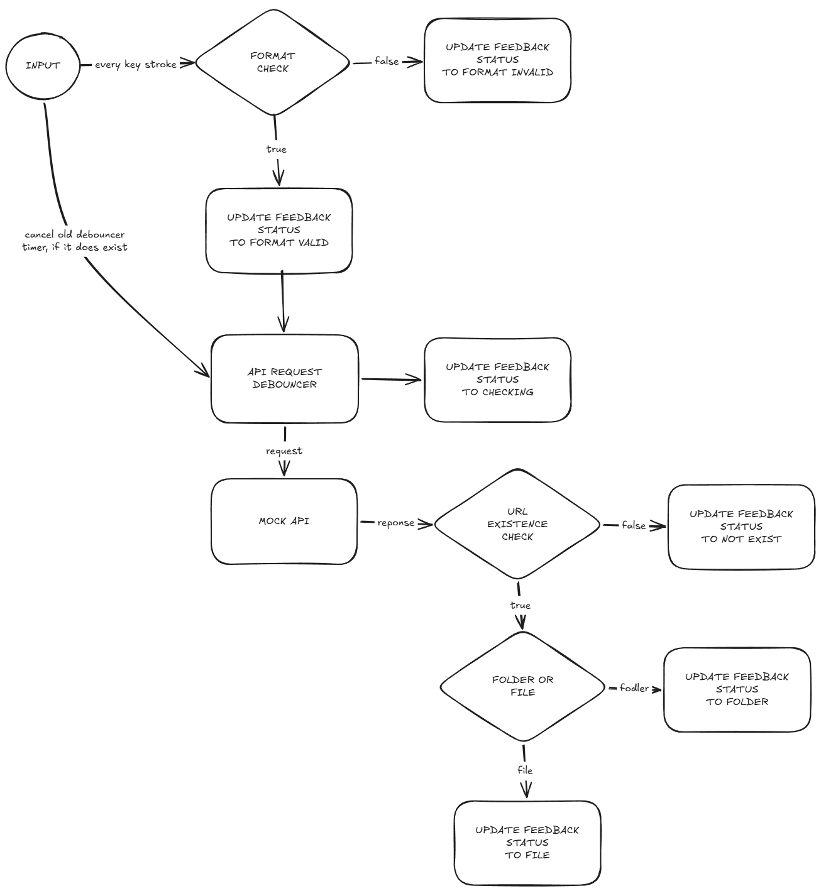

# URL Existence Checker

A lightweight, client-side application built with Vanilla TypeScript that validates user-input URLs and asynchronously checks their existence via a mock server.

> **Note:** This project is currently under active development.

## Flow
The diagram below illustrates the core logical flow of the application.

**Author:** Kaan Kara

